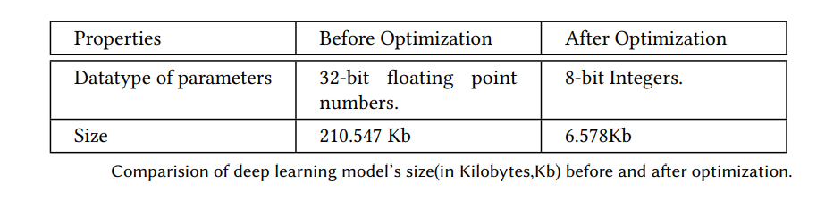
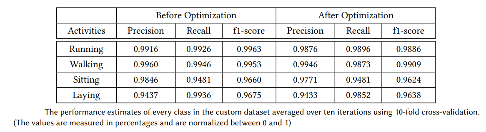
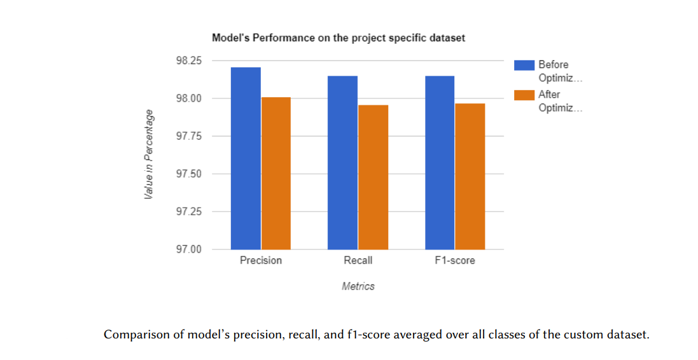
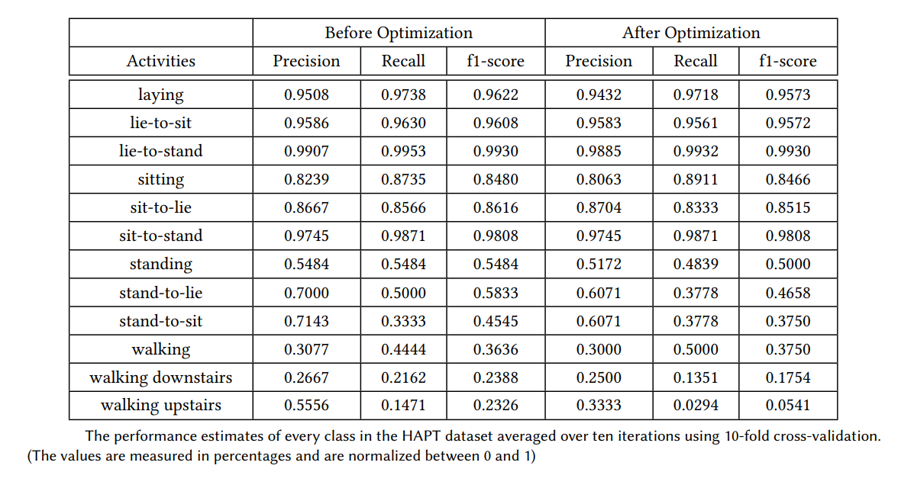
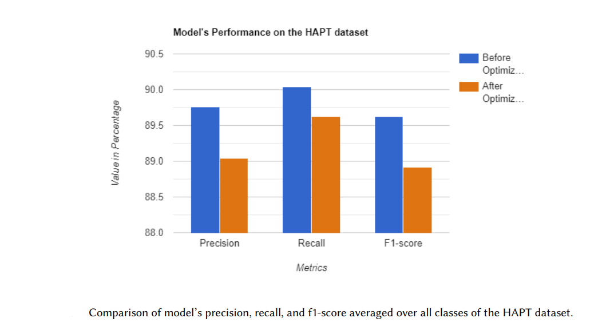

# HAR-in-Bangle.js

## Abstract:
Recent studies in Human Activity Recognition(HAR) have shown that  HAR on edge devices such as wearables has lower latency and better performance when inferred locally than on an external server. One of the conventional methods to achieve HAR on edge devices is by using deep learning algorithms. However, the edge devices are memory-constrained and have limited processing power, making it challenging to deploy state-of-the-art deep learning models. In this project, we develop and deploy a deep learning model for HAR on the bangle.js smartwatch. To transfer the model to the smartwatch, we optimize it using TensorFlow lite, reducing its size without losing much accuracy. As a result, we reduced the model's size by 96.87\%, i.e., from 210.547Kb to 6.578Kb, by losing only 0.2\% accuracy on a custom dataset and 0.9\% accuracy on a HAPT dataset.

## Structure of the project:
The project is structured in five steps. The first step of the project is to acquire and pre-process the accelerometer data. The next step is to develop and train a Convolutional Neural Network. Then, the third step is to optimize and deploy the model on bangle.js. After deployment, inference will be performed in real-time using the deployed model. The final stage of the project is to evaluate the model's performance using standard evaluation metrics such as precision, recall, and f1-score.

## Files in the Repository:
[HumanActivityRecognition.ipynb](HumanActivityRecognition.ipynb) : A step-by-step implementation of model development and model deployment.  
[prediction.js](prediction.js) : The script to perform inference on bangle.js.  
[Evaluation.ipynb](Evaluation.ipynb) : The jupyter notebook to evaluate the model using K-fold cross-validation.  
[LoadDataset.py](Utils/LoadDataset.py) : The script to load and split the dataset into train, test and validation datasets.  
[Optimization.py](Utils/Optimization.py) : The script to convert the keras model to the TensorFlow Lite model.

## Results

**Size Evaluation:** We have compressed the model using the TensorFlow lite's post quantization method and evaluated the model's size before and after the optimization.

  

**Peformance Evaluation:** The model's performance was evaluated before and after optimization using a custom dataset and a public HAPT dataset from the UCI machine learning repository. All the results were obtained using the k-fold cross-validation method.  

**Model's Performance on the custom dataset:** The custom dataset was collected from three subjects performing four activities, running, walking, sitting, and laying, wearing a bangle.js on the left-hand wrist. The data was sampled at 50Hz with a sensitivity of +/-8g.

  

**Model's Performance on HAPT Dataset:** The Human activity and Postural Transitions dataset is from the UCI Machine Learning Repository[[1]](#1). It was collected from 30 subjects performing basic activities and postural transitions with a smartphone mounted on the waist. The dataset includes 6 basic activities, laying, sitting, standing, walking, walking-downstairs, walking-upstairs, and 6 postural transitions, lie-to-sit, lie-to-stand, sit-to-lie, sit-to-stand,stand-to-lie, stand-to-sit sampled at 50Hz.

  

  

## References
<a id="1">[1]</a> 
Dua, Dheeru and Graff, Casey, (2017), 
UCI Machine Learning Repository,
url = "http://archive.ics.uci.edu/ml",
University of California, Irvine, School of Information and Computer Sciences.
